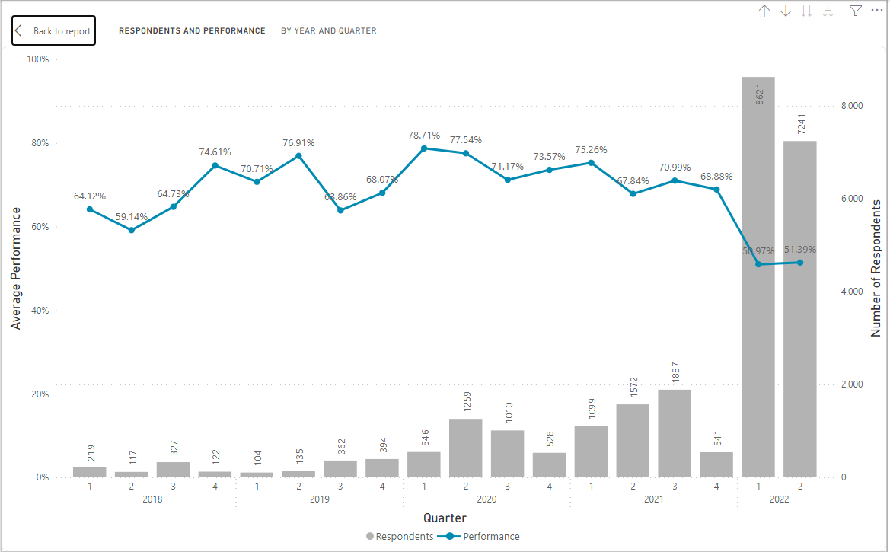

# The Siyavula Project

The COVID-19 pandemic altered the world’s routines, wreaking havoc on everything from workplace practices to supply chains
to education. In education, it affected an estimated 1.6 billion students worldwide (The World Bank). In Africa, research done 
between April and August 2020, Human Rights Watch found that school closures due to the COVID-19 pandemic compounded
previously existing inequalities, leaving children who were already at risk of being excluded from quality education to be most
affected (Human Rights Watch, 2020).
 
To reach students, many countries in Africa hastily employed some form of remote learning as an emergency response. These
educational responses evolved as the pandemic did.
 
 

## [Siyavula](https://www.siyavula.com/)

**Siyavula is known as a pioneer developer of high-quality free digital and print Math and Science textbooks for South African
schools.**

Alongside developing digital workbooks and teachers' guides, Siyavula has also developed an adaptive practice technology called 
Siyavula Practice, which has a complete set of South African curriculum-aligned open textbooks to create an offering for High 
School Mathematics, Physics, and Chemistry. The Siyavula platform has managed to reach the lowest economic segment 
(Quintile 1 schools) in South Africa. In fact, more than 50% of the learners using Siyavula Practice attend Quintile 1–3 schools, 
that is, no- and low-fee schools.
 
 

## The Data

Siyavula assisted Gauteng Department of Education (GDE) in 2022 with the creation of a baseline assessment instrument in the form of 
an assignment on the Siyavula platform. The baseline assessment consists of 50 Mathematics curriculum-aligned questions.

**This project focused on analyzing the results of Grade 8 student's performance on the baseline assessment.** 
**It aimed to understand gaps in the syllabus and any behavioral patterns.**
**An ideal outcome was a Power BI dashboard from a 100GB database hosted on AWS containing the learner’s information to outline learner performance pre- and post-COVID-19.**
**This dashboard will be used by the GDE to make data-driven decisions about where and how to intervene to better address learning needs.**
 
 

## The Purpose and Problem

To prevent learning losses from accumulating once children go back to school, countries need to adopt learning recovery
programs consisting of evidence-based strategies.

In this study, we empirically evaluated the impact of online learning during the pandemic on students’ performance by comparing 
it with that of pre- and post-pandemic cohorts.
 
 

## Methodology

The data was queried from a PostgreSQL database connected to the Amazon S3 bucket and the data was then loaded into a Jupyter notebook to 
facilitate the running of optimized SQL queries. The resulting dataset was stored in CSV and then loaded into Microsoft Power BI for data 
visualization through the creation of a dashboard. As the objective of the project focused on Gauteng and Grade 8 students, most of the 
analysis was steered in that direction.
 
 

## Dashboard and Findings

Figure 1. Dashboard Home Page showing an overview of the data analysis.

 

Figure 1 above shows the Home Page and important statistics of the data. In the baseline assessment, 25% of schools in Gauteng were assessed, and 8% of
Grade 8 students participated in the baseline assessment. The chart on the right-hand side shows the distribution of participants across the country.

 
 

Figure 2. Respondents and Performance by Year and Quarter

 

Figure 2 shows the number of respondents and their corresponding performance by Year and Quarter. The baseline assessment, on which this project was based,
was administered in 2022, hence 2022 having the highest number of respondents. This number of respondents was compared to those of previous years. The figure 
shows that the learners' average performance in the baseline assessment hovers around 70%, which implies students get 70% of the questions correctly on 
average, with a notable 19% drop in performance in 2022, as can be seen on the line chart.

It can equally be seen that the number of respondents has kept increasing over the years, indicating an increasing number of users interacting with the online learning platform.

 
 

Figure 3: Performance by Quintile

 

The Quintile represents the economic class of a respondent, with Quintile 1 being the lowest economic class and Quintile 5 being the highest.

Performance comparison by Quintile, shown in Figure 2, confirms that the highest economic class, quintile 5, has the highest
average performance in the baseline assessment, while quintile 1 has the lowest average performance in the baseline assessment.
This is an expected divide/difference due to the ease of access to resources (such as teachers with good qualifications) by quintile
5 learners as compared to quintile 1.

 
 

Figure 4: Performance by District and Quintile

 

The chart above shows the performance across Districts and Quintiles. It can be seen that Gauteng East has the highest drop in performance 
compared to the previous years. This can be used by Districts Heads to gain insights on how their districts performed against other districts 
and to make informed decisions on the need for intervention

 
 

Figure 5: Performance based on Topics and Sections

 

This chart shows learners' performance on various topics and sections of the subject, Mathematics, used in the baseline assessment. This will help 
stakeholders identify areas that need interventions, either in the form of revising the curriculum, investing more in the instructions, creating a 
prerequisite for the topics, introducing those topics to students either earlier or later.

 
 

Figure 6: Performance by Chapters

 

Students have the lowest average performance in Surface Area and Volume of 3D objects as a Chapter, both in the Baseline assessment and other assignments when
compared with other chapters. Learners equally have the highest average drop in performance in this chapter, which is 72.43%, and this calls for urgent remedial
measures.

 

[Dashboard Video Demonstration](https://youtu.be/KFYwLKjffAM)

 

## Conclusion

The data shows a gap in performance between quantile groups, districts, and baseline items/chapters. The dashboard created will
enable the Department of Education to make the necessary changes and adjustments in order to bridge this gap and give direction 
as to which areas they should focus on for the current and future 8th-grade cohorts.
With the dashboard we have created, the Deputy Director of Curriculum can identify key areas where the learners' performance is
low, as shown in Figures 1 and 2, and equally identify the possible reasons for this low performance.
The dashboard shows the distribution of learners and their performance across many variables, such as schools, districts, subject
sections/topics, subject titles, quintiles, years, and so on. And with this, Siyavula can identify key areas that need improvement.
